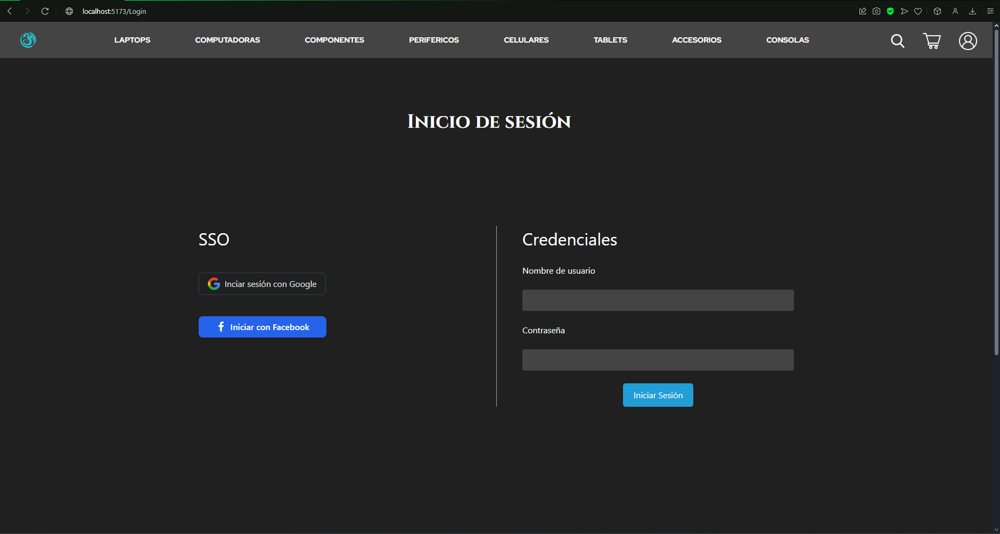

# Dracotech

Dracotech es una empresa líder especializada en soluciones de alto rendimiento para equipos tecnológicos, centrando su experiencia en dispositivos y componentes orientados al mercado de los videojuegos. Nuestro compromiso es optimizar la experiencia de juego mediante el desarrollo y la provisión de productos que superan los estándares de rendimiento, confiabilidad y durabilidad.

Con una amplia gama de soluciones que abarcan desde sistemas de enfriamiento avanzado, tarjetas gráficas de última generación y periféricos de precisión, hasta componentes personalizables para consolas y PCs de alto rendimiento, Dracotech se destaca por su capacidad para satisfacer las demandas de jugadores y profesionales que buscan maximizar cada aspecto de su equipo.

Nuestra misión es transformar la manera en que se disfruta de los videojuegos mediante innovación constante y tecnología de vanguardia, contribuyendo a que nuestros clientes alcancen su máximo potencial en cada partida. En Dracotech, combinamos pasión por el gaming y excelencia tecnológica para ofrecer productos que redefinen los límites del entretenimiento digital.

## Páginas

En la página principal existen unos productos marcados como ofertas, estos cuentan con precios menores a los regulares, además existe un apartado de productos nuevos donde se pueden observar los productos nuevos que entran a la tienda. En ambos casos si se le da click a un producto lo llevará a una pantalla con detalles específicos de este.

La barra de navegación principal cuenta con accesos directos a las páginas de categorías específicas, en esta se muestran los productos de cada uno como se muestra a continuación.

En esta página se observan los productos por categorías, aquí puede dar click sobre un producto para observar los detalles de cada uno como se ve a continuación.

En esta página se pueden observar los detalles de cada producto y una foto de muestra del producto, además de un botón para agregar al carrito el producto.

El carrito de compras muestra la cantidad del producto que desea comprar además de un resumen del precio actualizado con impuestos y envío, además puede agregar más del mismo producto en caso de requerir o quitarlo del carrito completamente.

Una vez terminado de seleccionar los productos, puede proceder a la pasarela de pago.

En la pasarela de pagos se ve un resumen de los productos y sus precios además de que se deben agregar a los datos de envío y los datos de la tarjeta de pago.

Una vez todo esté listo, se puede proceder al pago de los productos.

## Usuarios
Como parte de una experiencia más gratificante y personalizada puedes crear una cuenta con nosotros para poder realizar las compras, una vez creada la cuenta, puedes iniciar sesión en la siguiente página.

## Consideraciones a futuro

El sistema actualmente se encuentra trabajando con un servidor que no tiene una conexión a una base de datos, por lo que el próximo cambio necesario en el sistema, es la implementación de una base de datos donde se puedan poner los productos y los usuarios para optimizar el funcionamiento del mismo, al mismo tiempo que se brinda una capa mas de seguridad a la integridad de los datos.

Además de eso se podría realizar una factorización de los datos de los usuarios en caso de necesitar más de estos y una refactorización de la página de edición de estos ya que se encuentra obsoleta a la fecha.
